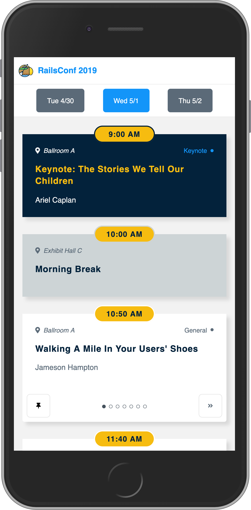

```{r config, include=FALSE}
library(knitr)
library(tidyverse)
library(patchwork)

opts_chunk$set(echo=FALSE, message=FALSE, warning=FALSE, cache=TRUE, dev="svg")

read_chunk("report.R")

theme_set(theme_minimal(base_size=14))
```
```{r report, include=FALSE}
```

Last week was RailsConf in Minneapolis. I wasn't there, but I was watching the
conference closely. The previous week, John Riccardi and I worked on the
[8thlight/thumbtrack](https://github.com/8thlight/thumbtrack) project.
Thumbtrack is a conference schedule planner, built using the static site
generator [GatsbyJS](https://www.gatsbyjs.org/). Thumbtrack was originally
designed to use at
RubyConf 2018 by Maggie Shemayev and Kelly Rauwerdink. John and I finished an
iteration on the project, updating it for RailsConf, and deploying it at
[RailsConf.Today](https://railsconf.today). Check it out on your phone if you
want to see what it's like.

One of our stories was to provide the site owner (played by Jim Remsik) with more
detailed analytics about how people were using the app. John and I paired on
swapping out the [GatsbyJS Google Analytics
plugin](https://www.gatsbyjs.org/packages/gatsby-plugin-google-analytics/) with
our own configuration, allowing us to record when and how people were using the
app.

This week, I took a look at the data we collected. I wanted to understand how
people were using the site during the conference.  This was partly to satisfy my
own curiosity, but also because I wanted to provide some information that could 
be used when planning how to improve the app for future conferences.

```{r screenshot, out.width="300px", fig.align="center"}

```

# How many people used the app during the conference?

The first question I had was how many people were using the site during the
conference. The site was visited a total of `r c_$during_conference_visits`
times.  Of course, many of these visits were by the same people. We know that
the site was visited by `r c_$num_devices` unique devices, but it is likely at
least some of these devices were owned by the same people.  <!-- We can surmise
that railsconf.today was visited by somewhat less than r c_$pct_of_conf% of the
people at a r c_$conf_size-person conference.-->

There were some unsurprising results, for example, that most visits were during
conference hours. But there were some promising findings as well, namely that
the number of visits was consistent across all three days of the conference.
People who used the app, used it each day of the conference. This suggests that
users found the app to be useful, and they weren't just checking it out once
and forgetting about it.

The figure below shows the page views of the site during the week of the
conference. Each point is the number of times the page was requested in an hour.
The hours of the conference are shown as vertical dashed lines. The rug ticks
show the times of the events at the conference. Visits during conference hours
are filled, and visits after conference hours are hollowed.

```{r visits, fig.width=8, fig.height=8}
sessions_per_hour_plot +
  { conference_day_type_plot + hour_type_plot } +
  plot_layout(nrow = 2)
```

To summarize, people used the app during each day of the conference (but
apparently not during lunch!). If we use this app for future conferences, we can
target visits in the days leading up to the conference as an indicator of our
success in promoting the app to conference goers. Also, we have a feature
request for adding Community Events to the conference schedule. These would be
events that are open to conference-goers, but not official conference events,
and are usually before or after the conference events for the day. If we add
this feature, we would expect to get more users outside of conference hours.

# When did users first visit the site?

How did the app spread among conference participants? As we would expect, we see
the largest pickup of new users during the first day of the conference. But the
site continued to pick up new users, even on the last day. This is promising, as
it suggests that people at the conference were sharing the app with others.

```{r new-users, fig.width=4, fig.height=4}
new_users_plot
```

# What devices did people use to visit the site?

This site was designed as a "mobile first" web application, but what percentage
of users used the app on a mobile device? During Rails Conf, **`r c_$pct_mobile`%
of users were on mobile devices.** The total numbers of mobile, desktop, and
tablet devices are shown below.

Some of the styling on the site that John and I implemented depends on a media
query based on browser width. I was curious what the app actually looked like
for users. For future uses of the site, we want to be able to ensure the best
possible viewing experience by knowing the typical viewing dimensions. During
the conference, the smallest mobile device view registered
`r c_$min_browser_width` x `r c_$min_browser_height` pixels. The distribution of
browser widths by device is shown below.

```{r devices, fig.width=8}
devices_plot +
  browser_sizes_plot +
  plot_layout(widths = c(0.4, 0.6))
```

# How did people interact with the site?

Users can interact with the app in a few ways. They can view the schedule for
different days of the conference. They can swipe to view the parallel events in
a single timeslot, or dropdown to see all the parallel events in a list. They
can pin an event in a parallel timeslot that they want to see. And they can
click on outbound links to the official conference website, or to 8th Light's
website.

All of our event metrics tell the same story: **Users were most active on the
first day of the conference**. This is interesting, because the number of visits
to the site was consistent across all days of the conference, as seen in Fig.
\@ref(fig:visits). This means that many users explored the app during the first
few visits, viewing all the events, and pinning the ones they wanted to go to.
On subsequent days, users continued to use the site, but without interacting
with it as much, indicating that they were using it as their scheduler for the
conference.

```{r events, fig.width=10}
events_plot
```

# Lessons learned with Google Analytics

John and I learned some lessons about Google Analytics that we would like to
change for next time. Although we correctly registered when event were
happening, we didn't include the relevent data in the posts. For example, we
don't care as much that a person pinned an event as we care **which event they
pinned**. In addition, for the swipeable views, dropdowns, and pin buttons that
can be toggled, we should record the direction of the toggle, so that we aren't
counting the same event twice.

# Conclusion

I had a great time working on this project with John and the 8th Lighters in the
Madison office, and I'm happy it was useful for the people at the conference.
There are a number of features John and I would like to continue to add to the
site, and we would love to see it continue to evolve and be used at future
conferences.

# Sources

* The [8thlight/thumbtrack](https://github.com/8thlight/thumbtrack) repo contains the source
  code for the GatsbyJS/React application.
* The [8thlight/thumbtrack-analytics](https://github.com/8thlight/thumbtrack-analytics) repo
  contains the Python code I wrote to query the Google Analytics API, and the R code I wrote
  to visualize the results.
