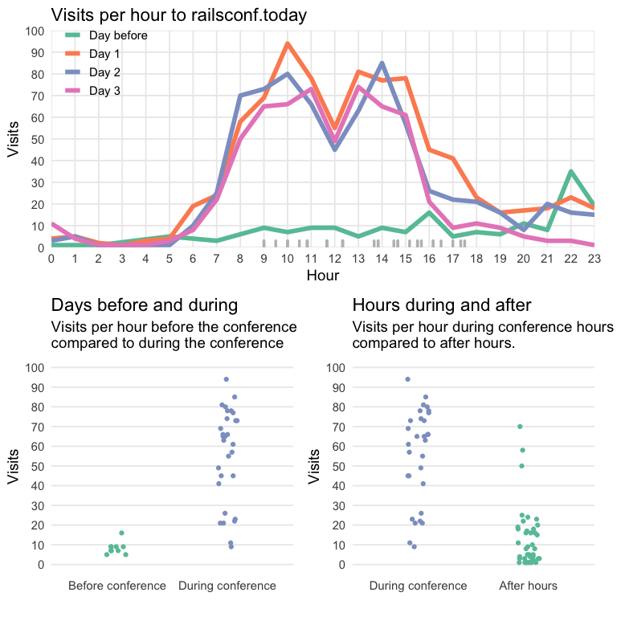

`Thumbtrack::railsconf.today`
================

# How many people were using the site?

During the conference, the site was visited a total of 2198 times. Many
of these visits were by the same people. We know that the site was
visited by 603 unique devices, but it is likely some of these devices
are owned by the same people \[1\]. Most of the visits were during
conference hours. The hours of the conference, along with the times of
the conference events, are shown below.

Key results:

  - Visits were consistent across all three days of the conference.
  - Low visits before the conference could indicate the need for better
    promotion.
  - Low visits after conference hours could indicate the need to support
    Community Events.

<!-- -->

1.  We are seeking to improve our Google Analytics integration. See
    [Issue \#88](https://github.com/8thlight/thumbtrack/issues/88).
