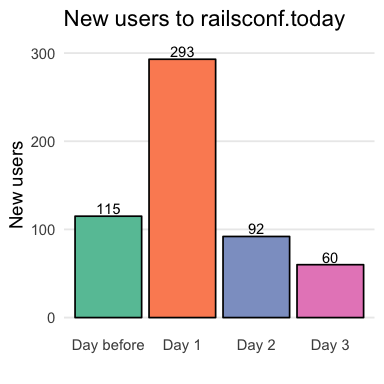
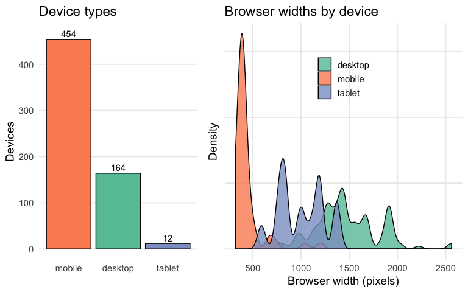
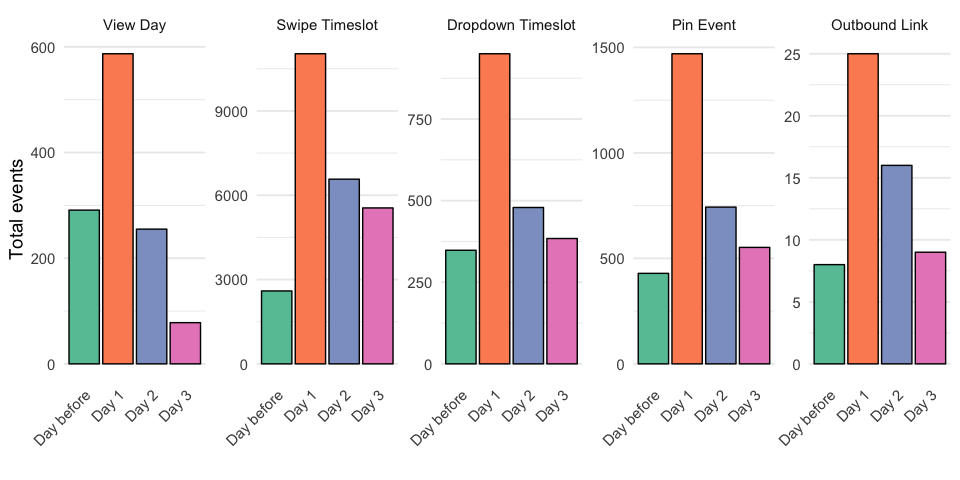

`Thumbtrack::railsconf.today`
================

# How many people were using the site?

During the conference, the site was visited a total of 2198 times. Many
of these visits were by the same people. We know that the site was
visited by 603 unique devices, but it is likely some of these devices
are owned by the same people \[1\]. Most of the visits were during
conference hours. The hours of the conference, along with the times of
the conference events, are shown below.

Key results:

  - Visits were consistent across all three days of the conference.
  - Low visits before the conference could indicate the need for better
    promotion.
  - Low visits after conference hours could indicate the need to support
    Community Events.

<!-- -->

# When did new users arrive at the site?

How did the railsconf.today spread among conference participants? If
people were sharing the app organically throughout the conference, we
might see a pickup in new users throughout the conference. Instead, what
we see is that new users were “front loaded”, meaning that most of them
knew about the app either before the conference or started using it in
the first day.

<!-- -->

# What devices did people use to view the site?

This site was designed as a “mobile first” web application, but what
percentage of users used the app on a mobile device? During Rails Conf,
72% of users were on mobile devices. The total numbers of mobile,
desktop, and tablet devices are shown below.

Some of the styling on the site depends on a media query based on
browser width. For future uses of the site, we want to be able to ensure
the best possible viewing experience by knowing the typical viewing
dimensions. During the conference, the smallest mobile device view
registered 320 x 280 pixels. The distribution of browser widths by
device is shown below.

<!-- -->

# How are people interacting with the site?

Users can interact with the app in a few ways. They can view the
schedule for different days of the conference. They can swipe to view
the parallel events in a single timeslot, or dropdown to see all the
parallel events in a list. They can pin an event in a parallel timeslot
that they want to see. And they can click on outbound links to the
official conference website, or to 8th Light’s website.

Users were most active in terms of events on the first day of the
conference. Given that visits to the site were consistent across all
days of the conference, this suggests that many users explored the site
during their first few visits, viewing all the events, and pinning the
ones they wanted to go to. On subsequent days, users continued to use
the site, but without interacting with it as much, indicating that they
were using it as their scheduler for the conference.

<!-- -->

# Lessons learned with Google Analytics

To get the most out of Google Analytics, we need to be sending more data
with each event. For example, we don’t care as much that a person pinned
an event as we care **which** event they pinned. For the dropdowns and
pin buttons that can be toggled, we should record the direction of the
toggle, so that we aren’t counting the same event twice.

The best analyses that can come from these data requires us to add the
concept of a user to the tracking system. By default Google Analytics
records unique IDs for each device, but given our current setup, we
cannot query events by client ID.

We might also consider adding campaign data to the URL so we can learn
how people are finding out about the app.

# Footnotes

1.  We are seeking to improve our Google Analytics integration. See
    [Issue \#88](https://github.com/8thlight/thumbtrack/issues/88).
